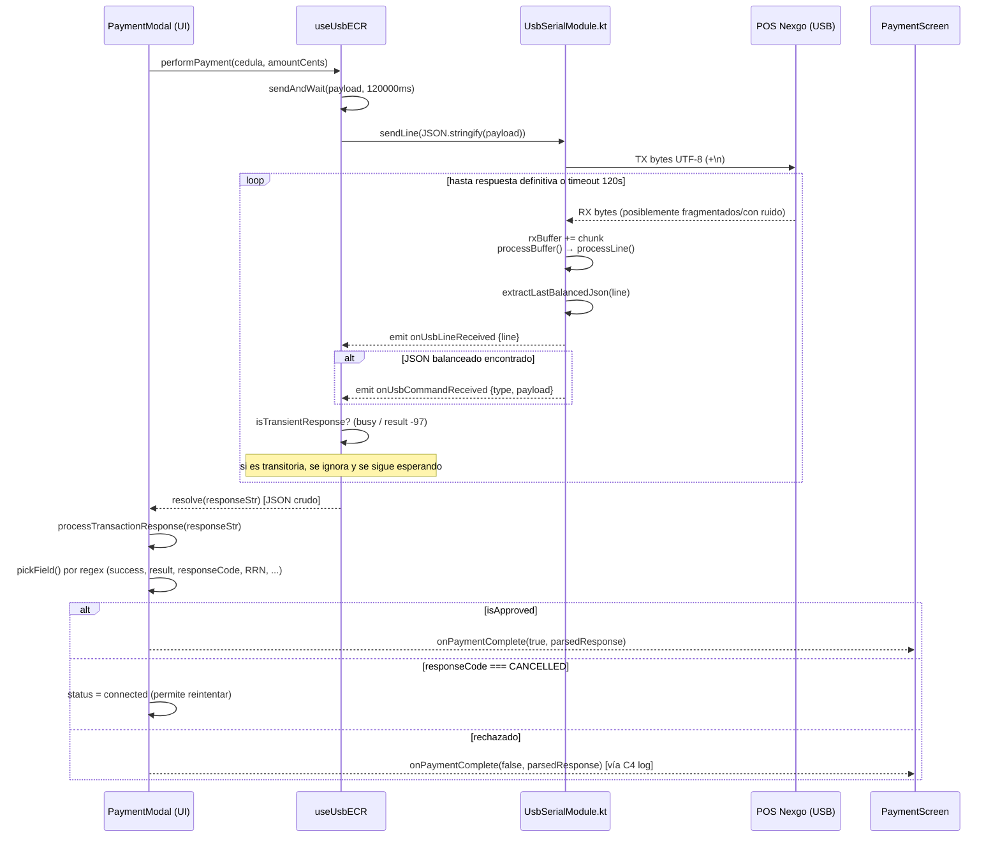

# Transacción USB/POS (PKBUSB) — Cómo enviamos, recibimos y parseamos

Este documento detalla, capa por capa, cómo el kiosco se comunica con el punto de venta (POS Nexgo/PKBUSB) por **USB serial**: qué se envía, qué se recibe, cómo se separan los mensajes dentro del buffer serial, cómo se extrae el JSON útil de una respuesta "sucia", y cómo cada capa (nativa Kotlin → hook React → UI) interpreta esa respuesta para decidir si el pago fue aprobado, rechazado, cancelado o si hay que reintentar.

Referencia rápida de archivos:

| Capa | Archivo |
|---|---|
| Transporte USB serial (nativo Android) | `android/app/src/main/java/com/keiver/pacheco/conviasa/UsbSerialModule.kt` |
| Puente React Native / orquestación de transacción | `hooks/useUsbECR.ts` |
| UI de pago + interpretación de negocio de la respuesta | `components/PaymentModal.tsx` |
| Parseo tolerante del cierre de lote (settlement) para impresión | `android/app/src/main/java/com/keiver/pacheco/conviasa/PrinterModule2.kt` (`parseSettlementData`) |
| Consumo del resultado en la pantalla de pago | `app/screens/PaymentScreen.tsx` |

---

## 1. Transporte físico: USB Serial (Kotlin)

`UsbSerialModule.kt` usa la librería `usb-serial-for-android`. Conexión fija a **115200 baud, 8 bits, sin paridad, 1 stop bit**:

```kotlin
port.setParameters(115200, 8, UsbSerialPort.STOPBITS_1, UsbSerialPort.PARITY_NONE)
```

El POS se detecta por **VID/PID** (no por nombre) — el `deviceName` que se guarda en `UsbContext` es solo informativo, no se usa para decidir a qué dispositivo conectarse.

### 1.1 Envío (TX)

Dos métodos expuestos a React Native:

- `sendLine(line, promise)` → hace `sendRaw(line + "\n", promise)`
- `sendRaw(text, promise)` → escribe los bytes UTF-8 al puerto con `write(data, 2000)` (timeout de escritura de 2s)

Detalle no obvio: en el **primer envío** tras abrir el puerto (`firstSend = true`) se hace un `Thread.sleep(300)` antes de escribir. Es un margen para que el POS termine de inicializar el puerto recién abierto; sin este delay el primer comando se pierde o se corrompe en algunos POS.

Todo envío se loguea como evento `onUsbLog` con el texto (con `\n` reemplazado por `\\n` para que sea legible).

### 1.2 Recepción (RX) — el buffer y el framing

La lectura corre en un hilo dedicado (`readThread`) que hace polling de hasta 4096 bytes cada 1000ms. Cada chunk leído se decodifica como UTF-8 y se **acumula** en un `StringBuilder` (`rxBuffer`) — el USB no garantiza que un mensaje llegue completo en un solo `read()`, puede llegar fragmentado en varios chunks o varios mensajes pueden llegar pegados en un solo chunk.

`processBuffer()` se ejecuta después de cada chunk recibido y trata de extraer **todos los mensajes completos** que ya estén en el buffer, en un loop (`while (changed && rxBuffer.isNotEmpty())`):

1. Recorta espacios en blanco al inicio.
2. Si el contenido recortado **empieza con `{`**: cuenta llaves (`{`/`}`) para encontrar dónde cierra ese primer objeto JSON balanceado. Si lo encuentra, extrae esa porción, la borra del buffer, y la pasa a `processLine()`.
3. Si **no** empieza con `{` (ej. el POS mandó ruido antes del JSON): busca el primer `\n` y trata esa línea completa (aunque no sea JSON puro) como un mensaje, se la pasa también a `processLine()`.

Esto es necesario porque el POS Nexgo a veces antepone basura antes del JSON real, por ejemplo:

```
[:true,"type":"payment",{"success":true,"responseCode":"00",...}
```

### 1.3 `processLine()` y extracción del "último JSON balanceado"

`processLine(line)`:
- Emite `onUsbLineReceived` con la línea cruda completa (raw, tal cual llegó) — esto sirve como respaldo para el lado JS.
- Llama a `extractLastBalancedJson(line)` para sacar el JSON real embebido en la línea.
- Si encuentra un JSON balanceado, emite `onUsbCommandReceived` con:
  - `type`: `"command"` si el JSON tiene la clave `"type"`, si no `"unknown"`.
  - `payload`: el string JSON extraído.

**`extractLastBalancedJson`** (existe una copia idéntica en Kotlin y en TypeScript — `hooks/useUsbECR.ts` la reimplementa para el fallback de `onUsbLineReceived`):

- Recorre la línea **de derecha a izquierda** buscando cada `}`.
- Por cada `}` encontrado, retrocede contando llaves hasta hallar el `{` que la balancea (soporta JSON anidado).
- Se queda con el candidato **más largo** de todos los que encuentre.
- No exige que la línea *empiece* con `{` — por eso, dado el ejemplo de arriba (`[:true,"type":"payment",{...}`), ignora el array `[true,...]` inicial (que no está balanceado con `{}`) y se queda con el objeto JSON real que viene después.

Esta es la razón de ser de todo el mecanismo: **el POS no siempre manda JSON puro**, así que en vez de intentar `JSON.parse()` directo (que fallaría), se busca el último objeto `{...}` bien balanceado dentro de la basura.

### 1.4 Eventos nativos emitidos (resumen)

| Evento | Cuándo | Payload |
|---|---|---|
| `onUsbStatusChange` | Puerto abierto/cerrado (conexión, desconexión física, error) | `{ isOpen: boolean }` |
| `onUsbLog` | Cada TX/RX crudo y mensajes de diagnóstico | `{ message: string }` |
| `onUsbDataReceived` | Cada chunk crudo leído del puerto (antes de framing) | `{ ascii: string }` |
| `onUsbLineReceived` | Cada línea/mensaje ya separado del buffer | `{ line: string }` |
| `onUsbCommandReceived` | Cuando esa línea contiene un JSON balanceado | `{ type: string, payload: string }` |

---

## 2. Orquestación de la transacción — `useUsbECR.ts`

### 2.1 Patrón "enviar y esperar" (`sendAndWait`)

Toda operación (`performPayment`, `performSettlement`, `performNfcOperation`) pasa por `sendAndWait(payload, timeoutMs = 120000)`:

1. Si ya había una transacción pendiente (no debería, pero por seguridad), la limpia.
2. Crea una `Promise` y la guarda en `pendingTransaction.current = { resolve, reject, timeoutId }`.
3. Arranca un `setTimeout` de **120 segundos** — si nadie resuelve la promesa antes, se rechaza con `Timeout esperando respuesta USB (120s)` y se registra un log crítico **C5**.
4. Envía el payload como JSON vía `UsbSerialModule.sendLine(JSON.stringify(payload))`.
5. Espera la promesa.

Es decir: **una sola transacción pendiente a la vez**, resuelta por el primer evento que "parezca" una respuesta válida — sea `onUsbCommandReceived` (camino feliz) o `onUsbLineReceived` (camino de respaldo).

### 2.2 Payload de pago

```ts
{
  type: 'payment',
  documentNumber,       // cédula ingresada en el modal
  amount,                // monto en céntimos (Math.round(amount * 100))
  waiterNum: '01',
  transType: 0,
  referenceNo: `REF-${Date.now()}`,
  timestamp: Date.now(),
}
```

`performSettlement()` manda `{ type: 'settlement', referenceNo, timestamp }`. `performNfcOperation` arma payloads distintos según la operación NFC (lectura/escritura de tarjeta, cambio de llave, etc. — no forma parte del flujo de pago normal).

### 2.3 Cómo se resuelve la promesa pendiente

Dos listeners compiten por resolver la transacción pendiente:

**a) `onUsbCommandReceived`** (camino principal): si hay una transacción pendiente, se valida primero con `isTransientResponse(payload)`:

```ts
payload.includes('"Device is busy') ||
payload.includes('busy processing') ||
payload.includes('"result":-97') ||
payload.includes('"result": -97')
```

Si es una respuesta transitoria (el POS está ocupado procesando algo previo, código `-97`), **se ignora** — no resuelve ni rechaza la promesa, simplemente espera a que llegue la respuesta definitiva. Esto es clave: sin este filtro, una respuesta intermedia de "busy" resolvería la transacción antes de tiempo con datos basura.

Si no es transitoria: guarda el payload en `receivedMessages`/`lastTransactionResponse`, limpia el timeout, y **resuelve** la promesa con el string JSON crudo.

**b) `onUsbLineReceived`** (fallback): solo actúa si hay transacción pendiente. Aplica `extractLastBalancedJson` sobre la línea (reimplementado en TS, igual al de Kotlin) y solo la considera candidata si el JSON extraído contiene `"success"` o `"type"`. También filtra respuestas transitorias con `isTransientResponse`. Este camino existe por si el nativo emite la línea pero por algún motivo el evento `onUsbCommandReceived` no se disparó (ej. el balanceo de llaves en Kotlin no encontró nada útil pero en JS sí, con la misma heurística de "último balanceado").

### 2.4 Desconexión durante una transacción

El listener de `onUsbStatusChange` detecta `isOpen: false`. Si en ese momento hay una transacción pendiente, la rechaza inmediatamente con `USB desconectado durante operación` y registra **C6**. Esto evita que el usuario quede esperando 120 segundos si el cable se desconecta.

---

## 3. Interpretación de negocio — `PaymentModal.processTransactionResponse`

Aquí es donde el string JSON crudo (ya extraído y filtrado por las capas anteriores) se convierte en una decisión de negocio: **aprobado / rechazado / cancelado**.

Importante: **no se usa `JSON.parse()`**. Se usa una serie de regex sobre el string crudo (`pickField`) para tolerar variaciones o campos con formato inconsistente que rompen el parseo estándar (el mismo problema de fragmentación/corrupción que motiva el settlement parser tolerante en Kotlin, ver sección 4):

```ts
const pickField = (re: RegExp) => responseStr.match(re)?.[1] ?? null;
```

Campos extraídos: `success`, `result` (raíz y dentro de `"data"` anidado — `innerResult`), `responseCode`, `responseMessage`, `RRN`, `referenceNumber`/`referenceNo`, `traceNumber`, `batchNum`/`batchNm`, `terminalID`, `merchantID`, `date`, `time`, `deviceSerial`, `errorCode`, `timestamp`, `transType`.

### 3.1 Regla de aprobación (`isApproved`)

```ts
const isApproved =
  errorCode === 0 &&
  (innerResult === null ? !hasNonZeroResult : innerResult === 0) &&
  !hasErrorMsg &&
  !hasInvalidResponseCode &&
  (successField === 'true' || codeField === '00' || msgUpper.includes('APPROV'));
```

Se exigen **cinco condiciones simultáneas** — el diseño es deliberadamente estricto porque un solo campo del POS no es confiable por sí solo (pueden venir inconsistentes entre sí):

1. `errorCode === 0`.
2. El `result` (buscando primero dentro de un posible objeto `"data"` anidado, si no en la raíz) debe ser `0`. Si no hay ningún campo `result` en absoluto, se acepta con tal de que no haya *ningún* `"result"` distinto de `0` en todo el string (`hasNonZeroResult`, un `matchAll` de todos los `"result":N`).
3. El mensaje (`responseMessage`) no contiene palabras de fallo: `FAIL`, `RECHAZ`, `CANCEL`, `DECLINED`, `ERROR`.
4. `responseCode` es `"00"` o no vino (si vino y no es `"00"`, se considera inválido).
5. Al menos uno de: `success: true` explícito, `responseCode === "00"`, o el mensaje contiene `APPROV`.

### 3.2 Ramas de resultado

- **Aprobado** → `setPaymentStatus('success')` + `onPaymentComplete?.(true, parsedResponse)`. Esto dispara en `PaymentScreen.handlePaymentComplete` todo el flujo post-pago (booking → generación de ticket → impresión, ver `docs/flujo.md`).
- **`responseCode === 'CANCELLED'`** → vuelve a `'connected'` con mensaje "Operación cancelada en el punto de venta. Puede intentarlo de nuevo." — permite reintentar sin cerrar el modal.
- **Cualquier otro caso** → `setPaymentStatus('error')` con el motivo (`responseMessage` o `responseCode`). El componente `handlePaymentComplete(false, ...)` en `PaymentScreen` registra **C4** (pago fallido silencioso) — importante: en este camino **no se dispara ningún Alert** al usuario (está comentado en el código), solo se resetea la UI a estado inicial.

### 3.3 Monto: quién manda el monto real

`amountSent = isDebug ? 100 : Math.round(amount * 100)` — el monto real en céntimos se calcula **en el cliente** antes de enviarlo al POS y se vuelve a usar tal cual en `parsedResponse.amount`, no se confía en que el POS lo devuelva. En modo debug (`isDebug` desde `UsbContext`) siempre se envían/asumen 100 céntimos (1 VES) para pruebas, sin importar el total real de la reserva.

### 3.4 Manejo de errores de transporte (try/catch de `performPayment`)

Si `performPayment` rechaza la promesa (timeout, desconexión, error de escritura), se clasifica por texto del mensaje de error:

```ts
const isConnectionLost = errMsg.includes('disconnected') || 'connection' || 'socket' ||
  'ECONNRESET' || 'ENOTCONN' || 'NOT_OPEN' || 'no está abierto';
```

- Si es pérdida de conexión → `forceCleanup()` (cierra puerto, limpia estado) + mensaje "El punto de venta USB no está conectado...".
- Si es timeout → "El tiempo de pago expiró. El punto de venta canceló la operación."
- Cualquier otro → el mensaje de error tal cual.

---

## 4. Parseo tolerante del cierre de lote (settlement) — `PrinterModule2.parseSettlementData`

Cuando se imprime el reporte de cierre de lote, el JSON que devuelve el POS puede llegar **corrupto por fragmentación USB** (bytes sueltos perdidos, comas faltantes, dobles dos-puntos `::`). `parseSettlementData(raw: String)` en Kotlin usa una estrategia de dos niveles:

1. **Intento primario**: `org.json.JSONObject(raw)` — si el JSON es válido, se mapea con una tabla de alias porque el POS Nexgo no usa nombres de campo consistentes entre firmwares/lotes:

   ```kotlin
   "batchNumber" to listOf("CreditBatchNo", "DebitBatchNo", "batchNumber", "batchNum")
   "saleTotal" to listOf("totalDebitCardSale", "totalCreditCardSale", "totalExtraSale", "saleTotal")
   "merchantId" to listOf("merchantID", "merchantId")
   ...
   ```

   Para cada clave canónica, recorre sus alias en orden y toma el primero que exista y no sea `null`.

2. **Fallback por regex**: si `JSONObject(raw)` lanza excepción (JSON roto), cae a una serie de `Regex` tolerantes tipo `""(?:merchantID|merchantId|merchant)"\s*:\s*"([^"]+)""` que buscan el patrón `"clave": "valor"` directamente en el string sin necesitar que el JSON completo sea válido. Incluso reconstruye `saleTotal` sumando manualmente `totalDebitCardSale + totalCreditCardSale + totalExtraSale` si cada uno se pudo extraer por separado.

Este es el mismo principio que en `PaymentModal.processTransactionResponse` (sección 3): **nunca confiar en que el JSON completo parseará correctamente**, extraer campo por campo con regex como red de seguridad.

---

## 5. Diagrama de secuencia — pago completo



---

## 6. Casos borde ya cubiertos (y por qué)

| Caso | Dónde se maneja | Comportamiento |
|---|---|---|
| POS antepone ruido antes del JSON (`[:true,"type":...{...}`) | `extractLastBalancedJson` (Kotlin y TS) | Se descarta el prefijo no balanceado, se toma el último `{...}` balanceado |
| Mensaje llega fragmentado entre varios `read()` | `rxBuffer` (StringBuilder acumulativo) en Kotlin | Se acumula hasta que `processBuffer()` encuentra un objeto completo |
| Respuesta intermedia "device busy" / `result: -97` | `isTransientResponse` en `useUsbECR.ts` | Se ignora, sigue esperando la respuesta real sin resolver/rechazar |
| USB se desconecta a mitad de transacción | `onUsbStatusChange` listener en `useUsbECR.ts` | Rechaza la promesa pendiente inmediatamente + log crítico **C6** |
| No llega ninguna respuesta en 120s | `setTimeout` en `sendAndWait` | Rechaza con mensaje de timeout + log crítico **C5** |
| JSON de settlement corrupto (bytes perdidos, `::`) | `parseSettlementData` en `PrinterModule2.kt` | Fallback a regex tolerante + mapeo de alias de campos |
| Campos de POS inconsistentes entre sí (ej. `success` no coincide con `responseCode`) | `isApproved` en `processTransactionResponse` | Exige 5 condiciones simultáneas en vez de confiar en un solo campo |
| Operación cancelada en el POS físico | `responseCode === 'CANCELLED'` en `processTransactionResponse` | Vuelve a estado `connected`, permite reintentar sin cerrar el modal |
| Pago aprobado por USB pero falla el booking/ticket después | `PaymentScreen.handlePaymentComplete` | Encola en `recoveryQueue` (`RETRY_BOOKING`/`RETRY_TICKET`) + log **C1**/**C2**/**C3** — ver `utils/recoveryQueue.ts` y `utils/criticalLogger.ts` |

---

## 7. Relación con logs críticos (`criticalLogger`)

Casos que se originan directamente en este flujo USB/POS:

- **C4** — pago fallido o rechazado silenciosamente (rama `else` de `processTransactionResponse` / `handlePaymentComplete(false, ...)`).
- **C5** — timeout de 120s esperando respuesta del POS (`sendAndWait`).
- **C6** — USB desconectado durante una operación pendiente (`onUsbStatusChange` listener).

Los casos **C1/C2/C3** (booking/ticket fallidos) ocurren *después* de que el pago ya fue aprobado por el POS — no son parte del parseo USB en sí, pero consumen `transactionData` (el `parsedResponse` de esta capa) para poblar el log y la cola de recuperación.
